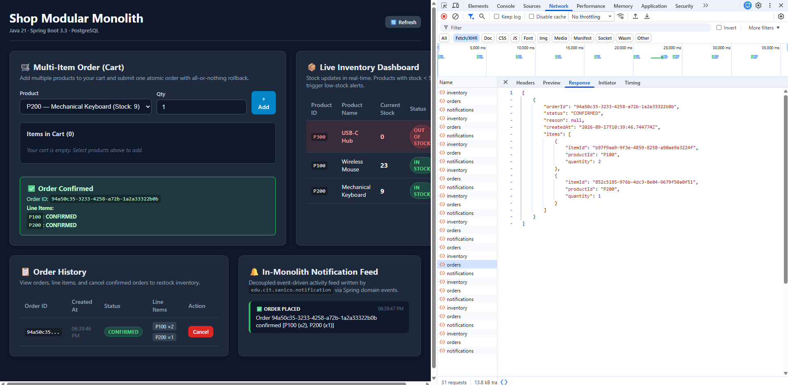
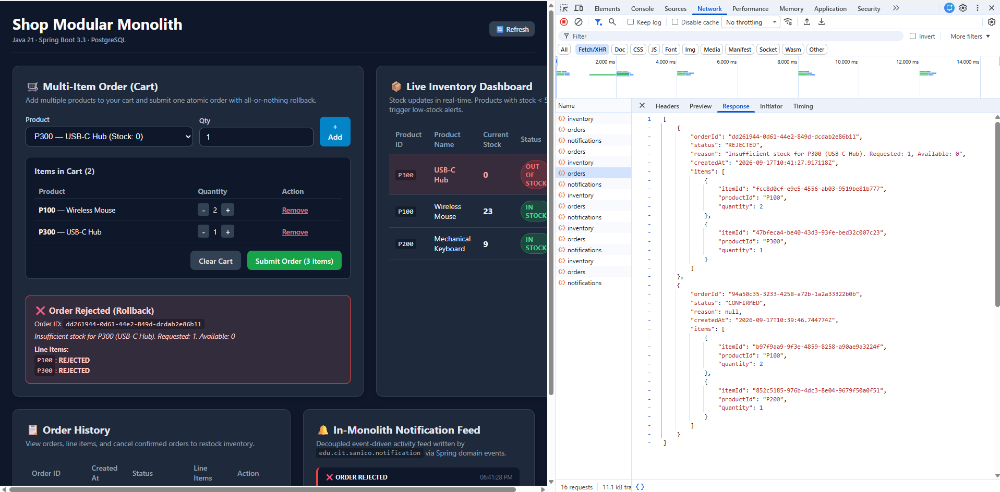
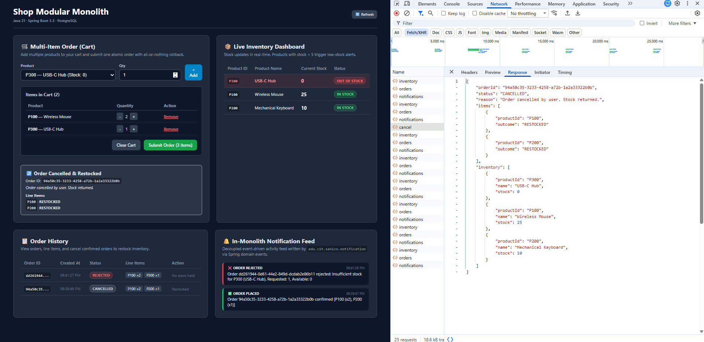
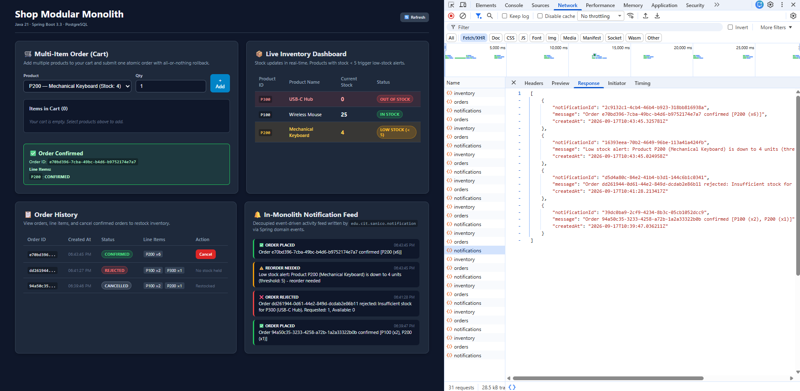

# Activity 04 – Modular Monolith Integration (Lab 2)

**Stack:** Java 21 · Spring Boot 3.3 · React 18 (Vite) · Supabase (PostgreSQL)  
**Author:** Sanico  
**Packages:**
- `edu.cit.sanico.shop` — Order module
- `edu.cit.sanico.inventory` — Inventory module
- `edu.cit.sanico.notification` — Notification module (in-monolith domain event consumer)

---

## Architecture & Module Boundaries

The application is structured as an **in-process modular monolith**. The three modules communicate strictly across clean architectural boundaries:

```
+-----------------------------------------------------------------------------------+
|                                 ShopApplication                                   |
|                                                                                   |
|  [edu.cit.sanico.shop]         [edu.cit.sanico.inventory]                        |
|  - OrderService (interface)    - InventoryService (interface)                     |
|  - OrderServiceImpl (pkg-pvt)  - InventoryServiceImpl (pkg-pvt)                   |
|       |                              |                                            |
|       |-- in-process call ---------->|                                            |
|       |   reserve() / restock()      |                                            |
|       |                              |                                            |
|       | publishes                    | publishes                                  |
|       | OrderPlacedEvent             | LowStockEvent                              |
|       | OrderRejectedEvent           |                                            |
|       v                              v                                            |
|  ================ Spring ApplicationEventPublisher =============================  |
|                                      |                                            |
|                                      v listens via @EventListener                 |
|                        [edu.cit.sanico.notification]                              |
|                        - NotificationService (interface)                          |
|                        - NotificationServiceImpl (pkg-pvt)                         |
|                        - Notification (JPA Entity -> notifications table)         |
+-----------------------------------------------------------------------------------+
```

### Decoupling Rules Enforced:
1. **Package-Private Implementations**:
   - `InventoryServiceImpl` has default (package-private) visibility.
   - `OrderServiceImpl` has default (package-private) visibility.
   - `NotificationServiceImpl` has default (package-private) visibility.
   External callers are forced to interact only through public interfaces (`InventoryService`, `OrderService`, `NotificationService`).
2. **Notification Module Isolation**:
   - The Notification module depends **only on event records** (`OrderPlacedEvent`, `OrderRejectedEvent`, `LowStockEvent`).
   - It **never calls** `InventoryService` or `OrderService`.
   - Neither `shop` nor `inventory` imports anything from `edu.cit.sanico.notification`.

---

## Project Structure

```
activity04/
├── backend/
│   ├── pom.xml
│   ├── .env.example
│   └── src/
│       ├── main/
│       │   ├── java/edu/cit/sanico/
│       │   │   ├── ShopApplication.java
│       │   │   ├── config/
│       │   │   │   └── CorsConfig.java
│       │   │   ├── inventory/
│       │   │   │   ├── InventoryItem.java
│       │   │   │   ├── InventoryRepository.java
│       │   │   │   ├── InventoryService.java          # public interface
│       │   │   │   ├── InventoryServiceImpl.java      # package-private implementation
│       │   │   │   ├── ReserveResult.java
│       │   │   │   └── event/
│       │   │   │       └── LowStockEvent.java         # domain event
│       │   │   ├── shop/
│       │   │   │   ├── Order.java
│       │   │   │   ├── OrderItem.java                 # line items
│       │   │   │   ├── OrderRepository.java
│       │   │   │   ├── OrderRequest.java              # multi-item DTO
│       │   │   │   ├── OrderResponse.java
│       │   │   │   ├── OrderHistoryResponse.java
│       │   │   │   ├── OrderService.java              # public interface
│       │   │   │   ├── OrderServiceImpl.java          # package-private implementation
│       │   │   │   ├── OrderController.java
│       │   │   │   └── event/
│       │   │   │       ├── OrderPlacedEvent.java      # domain event
│       │   │   │       └── OrderRejectedEvent.java    # domain event
│       │   │   └── notification/
│       │   │       ├── Notification.java              # entity
│       │   │       ├── NotificationRepository.java
│       │   │       ├── NotificationService.java       # public interface
│       │   │       ├── NotificationServiceImpl.java   # package-private event listener
│       │   │       └── NotificationController.java
│       │   └── resources/
│       │       └── application.properties
│       └── test/
│           └── java/edu/cit/sanico/
│               ├── inventory/InventoryServiceTest.java
│               ├── notification/NotificationServiceTest.java
│               └── shop/OrderServiceTest.java
├── frontend/
│   ├── package.json
│   ├── vite.config.js
│   └── src/
│       ├── App.jsx                                    # Multi-item cart, live dashboard, history, feed
│       ├── App.css
│       └── main.jsx
├── db/
│   └── schema.sql                                     # Recreates schema & seed data
└── README.md
```

---

## Supabase Setup Steps (carried over from Lab 1)

1. **Log in to Supabase**: Navigate to your project dashboard at <https://supabase.com>.
2. **Run Schema Script**:
   - Go to **SQL Editor** from the sidebar.
   - Copy and paste the entire content of [`db/schema.sql`](db/schema.sql) into the query editor and click **Run**.
   - This creates all necessary tables and seed data from scratch:
     - `inventory` table (seeded with `P100`, `P200`, `P300`)
     - `orders` table (with `status` supporting `CONFIRMED`, `REJECTED`, and `CANCELLED`)
     - `order_items` table (storing line items for multi-item orders)
     - `notifications` table (storing domain event messages)
3. **Retrieve Credentials**:
   - Go to **Project Settings → Database → Connection parameters**.
   - Note your host, port (`5432`), user (`postgres` or pooler user `postgres.<project-ref>`), and password.
4. **Configure Backend Credentials**:
   - In `backend/`, copy `.env.example` to `.env` (or pass via environment variables):
     ```env
     DB_URL=jdbc:postgresql://<host>:5432/postgres?sslmode=require
     DB_USERNAME=postgres.<project-ref>
     DB_PASSWORD=your-supabase-db-password
     ```
   - Note: `.env` is git-ignored and must never be committed.

## Supabase Database Schema
The script drops existing tables in reverse dependency order and recreates:

```sql
-- 1. Inventory table
CREATE TABLE inventory (
    product_id VARCHAR(10)  PRIMARY KEY,
    name       VARCHAR(100) NOT NULL,
    stock      INT          NOT NULL CHECK (stock >= 0)
);

-- 2. Orders table (supports CONFIRMED, REJECTED, CANCELLED)
CREATE TABLE orders (
    order_id   UUID         PRIMARY KEY DEFAULT gen_random_uuid(),
    status     VARCHAR(20)  NOT NULL,
    reason     TEXT,
    created_at TIMESTAMPTZ  NOT NULL DEFAULT now()
);

-- 3. Order Items table (multi-item orders)
CREATE TABLE order_items (
    item_id    UUID        PRIMARY KEY DEFAULT gen_random_uuid(),
    order_id   UUID        NOT NULL REFERENCES orders(order_id) ON DELETE CASCADE,
    product_id VARCHAR(10) NOT NULL REFERENCES inventory(product_id),
    quantity   INT         NOT NULL CHECK (quantity > 0)
);

-- 4. Notifications table (event-driven notification module)
CREATE TABLE notifications (
    notification_id UUID        PRIMARY KEY DEFAULT gen_random_uuid(),
    message         TEXT        NOT NULL,
    created_at      TIMESTAMPTZ NOT NULL DEFAULT now()
);

-- 5. Seed data
INSERT INTO inventory (product_id, name, stock) VALUES
    ('P100', 'Wireless Mouse',      25),
    ('P200', 'Mechanical Keyboard', 10),
    ('P300', 'USB-C Hub',            0)
ON CONFLICT (product_id) DO UPDATE SET
    name = EXCLUDED.name,
    stock = EXCLUDED.stock;
```

---

## Running the Application

### 1. Backend

> **Prerequisite:** Java 21 + Maven (`mvnw.cmd` included)

1. Set environment variables in your terminal:
   ```powershell
   $env:DB_URL="jdbc:postgresql://db.<your-supabase-ref>.supabase.co:5432/postgres"
   $env:DB_USERNAME="postgres"
   $env:DB_PASSWORD="your-supabase-db-password"
   ```
2. Run backend:
   ```powershell
   cd backend
   .\mvnw.cmd spring-boot:run
   ```
   API runs on `http://localhost:8080`.

3. Run automated tests:
   ```powershell
   cd backend
   .\mvnw.cmd test
   ```

### 2. Frontend

> **Prerequisite:** Node.js 18+

```powershell
cd frontend
npm install
npm run dev
```
Open **http://localhost:5173** in your browser.

---

## API Endpoints

| Method | Path | Description |
|--------|------|-------------|
| `GET` | `/api/inventory` | Returns all products with current stock |
| `POST` | `/api/orders` | Places a multi-item order with all-or-nothing rollback |
| `GET` | `/api/orders` | Returns order history with status and line items |
| `POST` | `/api/orders/{orderId}/cancel` | Cancels confirmed order and restocks reserved quantities |
| `GET` | `/api/notifications` | Returns notification activity feed log |

---

### Request & Response Examples

#### 1. POST `/api/orders` — Multi-Item Order (Success)
**Request:**
```json
{
  "items": [
    { "productId": "P100", "quantity": 2 },
    { "productId": "P200", "quantity": 1 }
  ]
}
```
**Response (200 OK):**
```json
{
  "orderId": "7a356247-494b-4b10-a228-b80c550df2c0",
  "status": "CONFIRMED",
  "reason": null,
  "items": [
    { "productId": "P100", "outcome": "CONFIRMED" },
    { "productId": "P200", "outcome": "CONFIRMED" }
  ],
  "inventory": [
    { "productId": "P100", "name": "Wireless Mouse", "stock": 23 },
    { "productId": "P200", "name": "Mechanical Keyboard", "stock": 9 },
    { "productId": "P300", "name": "USB-C Hub", "stock": 0 }
  ]
}
```

#### 2. POST `/api/orders` — Multi-Item Order (Rejected: All-or-Nothing Rollback)
**Request:**
```json
{
  "items": [
    { "productId": "P100", "quantity": 2 },
    { "productId": "P300", "quantity": 1 }
  ]
}
```
**Response (200 OK):**
```json
{
  "orderId": "cb315c1e-ea13-448f-8ae0-ea4f02f9c7be",
  "status": "REJECTED",
  "reason": "Insufficient stock for P300 (USB-C Hub). Requested: 1, Available: 0",
  "items": [
    { "productId": "P100", "outcome": "REJECTED" },
    { "productId": "P300", "outcome": "REJECTED" }
  ],
  "inventory": [
    { "productId": "P100", "name": "Wireless Mouse", "stock": 25 },
    { "productId": "P200", "name": "Mechanical Keyboard", "stock": 10 },
    { "productId": "P300", "name": "USB-C Hub", "stock": 0 }
  ]
}
```
*(Notice: P100 stock remained at 25. No partial reservation occurred!)*

#### 3. POST `/api/orders/{orderId}/cancel` — Cancellation & Restock
**Response (200 OK):**
```json
{
  "orderId": "7a356247-494b-4b10-a228-b80c550df2c0",
  "status": "CANCELLED",
  "reason": "Order cancelled by user. Stock returned.",
  "items": [
    { "productId": "P100", "outcome": "RESTOCKED" },
    { "productId": "P200", "outcome": "RESTOCKED" }
  ],
  "inventory": [
    { "productId": "P100", "name": "Wireless Mouse", "stock": 25 },
    { "productId": "P200", "name": "Mechanical Keyboard", "stock": 10 },
    { "productId": "P300", "name": "USB-C Hub", "stock": 0 }
  ]
}
```
- If `orderId` does not exist → returns `404 Not Found`.
- If order is already `CANCELLED` → returns `409 Conflict`.

#### 4. GET `/api/notifications` — Notification Activity Feed
**Response (200 OK):**
```json
[
  {
    "notificationId": "6c457f92-5fe4-4d89-9836-8e5baadbb03a",
    "message": "Low stock alert: Product P200 (Mechanical Keyboard) is down to 4 units (threshold: 5) - reorder needed",
    "createdAt": "2026-09-17T18:20:10.123+08:00"
  },
  {
    "notificationId": "d3810ec5-857e-4b68-b769-cf4d88eef00c",
    "message": "Order 7a356247-494b-4b10-a228-b80c550df2c0 confirmed [P100 (x2), P200 (x1)]",
    "createdAt": "2026-09-17T18:20:05.654+08:00"
  },
  {
    "notificationId": "1a084c71-2e91-45df-9fe1-096a75f10255",
    "message": "Order cb315c1e-ea13-448f-8ae0-ea4f02f9c7be rejected: Insufficient stock for P300 (USB-C Hub). Requested: 1, Available: 0",
    "createdAt": "2026-09-17T18:19:45.321+08:00"
  }
]
```

---

## Architectural Note: Synchronous vs. `@Async` Event Processing

In this lab, event listeners are kept **synchronous by default**:

```java
@EventListener
@Transactional
public void onOrderPlaced(OrderPlacedEvent event) {
    // executes within caller thread
}
```

### Why Synchronous is Appropriate for this Monolith:
1. **Read-Your-Own-Writes Guarantee**: When the frontend submits `POST /api/orders`, the HTTP response returns only after the notification row has been saved in the database. When the frontend immediately triggers `fetchData()` (`GET /api/notifications`), the user is guaranteed to see the latest notification without any race conditions or artificial polling delays.
2. **Transactional Consistency & Simplicity**: Since all modules run in a single JVM connected to PostgreSQL, handling the notification synchronously inside the transaction ensures the event is not lost if the process crashes immediately after returning the response.
3. **Low Latency**: Writing a single log row to PostgreSQL adds negligible overhead (< 5ms) to the in-process request.

### When to Make Event Listeners `@Async`:
If notifications involved external I/O (e.g., sending emails via SendGrid, dispatching webhooks, or calling third-party SMS gateways), executing them synchronously would degrade order placement latency and cause orders to fail if the external service times out. In that case:
- Enable async with `@EnableAsync` on configuration and annotate the listener with `@Async`.
- Combine with `@TransactionalEventListener(phase = TransactionPhase.AFTER_COMMIT)` so notifications are only dispatched after the database transaction commits successfully.

---

## Network Tab Evidence

Place your captured screenshots in the project root with the following filenames:

### Scenario 1: Confirmed Multi-Item Order (P100 qty 2, P200 qty 1)

*Endpoint: `POST /api/orders` · Status: `200 OK` · Response shows `"status":"CONFIRMED"` and all line items confirmed.*

### Scenario 2: Rejected Multi-Item Order (All-or-Nothing Rollback: P100 qty 2, P300 qty 1)

*Endpoint: `POST /api/orders` · Status: `200 OK` · Response shows `"status":"REJECTED"`, reason indicates insufficient stock for P300, and zero stock was deducted from P100.*

### Scenario 3: Order Cancellation with Restock

*Endpoint: `POST /api/orders/{orderId}/cancel` · Status: `200 OK` · Response shows `"status":"CANCELLED"` and subsequent `GET /api/inventory` reflects restored stock levels.*

### Scenario 4: Notification Feed with Confirmed, Rejected, and Low-Stock Alert

*Endpoint: `GET /api/notifications` · Status: `200 OK` · Shows confirmed order, rejected order, and the distinct low-stock alert triggered when P200 dropped below threshold 5.*

---

## Reflection (300–500 words)

### 1. In-Process Multi-Item Atomicity vs. Distributed Sagas Across a Network

In our modular monolith, multi-item orders touch `InventoryService.reserve()` repeatedly within a single request. What ensures this stays strictly atomic is **Spring's `@Transactional` boundary** coupled with a shared relational database. When `OrderServiceImpl.placeOrder()` executes, Spring binds a single database connection and transaction context to the current thread. Because `orders`, `order_items`, and `inventory` share the same PostgreSQL database, any unexpected runtime exception or constraint violation causes Hibernate and the transaction manager to execute a single atomic rollback, reverting all stock decrements and entity persists. Additionally, our application enforces an in-process pre-validation pass that inspects available quantities for every line item before invoking `reserve()`, ensuring no partial reservations ever occur.

If Order and Inventory were split across a network into separate microservices, ACID transactions across network boundaries are impractical due to the blocking nature and availability bottlenecks of two-phase commit (2PC). Instead, we would need to implement an **orchestrated or choreographed Saga pattern with compensating transactions**. When an order is placed, the Order service would create a `PENDING` order and emit an event (or command) to reserve stock. If reservation fails for any line item (e.g., product out of stock), a compensating action must be dispatched to return any already-reserved stock back to the inventory pool before marking the order `REJECTED`. Furthermore, we would need to implement the **Transactional Outbox pattern** to guarantee reliable message delivery and assign unique idempotency keys to all commands to safely withstand network retries and duplicate messages.

### 2. Domain Events vs. Direct Method Invocation & Decoupling

Publishing domain events via `ApplicationEventPublisher` fundamentally changes the relationship between `OrderService` and `Notification`. With direct method invocation, `OrderService` is tightly coupled to the notification implementation: it must know the interface, manage its lifecycle, handle its exceptions, and endure any latency caused by notification logging. By publishing `OrderPlacedEvent` and `OrderRejectedEvent`, the dependency is completely decoupled. `OrderService` simply broadcasts that an event occurred within its domain without caring who consumes it or what they do. `NotificationServiceImpl` depends strictly on the immutable event records, and neither `shop` nor `inventory` imports anything from `edu.cit.sanico.notification`.

If Notification became a separate microservice:
- We would introduce a **distributed message broker** (such as Apache Kafka, RabbitMQ, or AWS SQS) to transport events across service boundaries.
- To prevent dual-write anomalies (where a database transaction succeeds but network publishing fails), the monolith would implement a **Transactional Outbox pattern**, writing events to an `outbox` table within the local transaction and relaying them asynchronously via CDC (e.g., Debezium) or a polling worker.
- Since distributed brokers guarantee at-least-once delivery, the Notification service would need **idempotent consumer logic** (recording processed event IDs in a deduplication table) along with a Dead Letter Queue (DLQ) for poison messages.

### 3. Microservice Extraction Strategy: Picking the First Candidate

If forced to extract exactly one module into its own microservice first, the ideal candidate is the **Notification module**.

**Why Notification first:**
1. **Zero Impact on Critical Business Path**: Notification is a side-effect consumer and write sink. If Notification experiences downtime or latency, users can still place, validate, and cancel orders uninterrupted. Extracting Inventory first would immediately force the core checkout flow into distributed transactions and network fallbacks.
2. **One-Way Asynchronous Coupling**: Notification has zero inbound synchronous RPC calls—it only listens to events. Its blast radius on system availability is minimal.
3. **Different Scalability Needs**: Notifications often scale differently (e.g., handling email/SMS dispatch, webhook fan-out, or user push notifications) and benefit from independent deployment cadences.

**Changes required in code:**
1. Remove `edu.cit.sanico.notification` from the monolith codebase.
2. Replace Spring's local `eventPublisher.publishEvent()` with a message publisher (e.g., Spring Cloud Stream or KafkaTemplate) writing to a topic like `shop.events`.
3. Stand up the Notification service as an independent Spring Boot application with its own database, consuming from the message broker via `@KafkaListener`, and expose `GET /api/notifications` behind an API Gateway.

